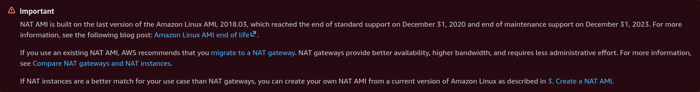
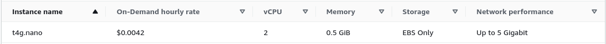

# fck-nat - seriously though    
### What's my beef with NAT?  

Well nothing with NAT in general, it's a great idea that along with non-routable subnets and dhcp, has kept IPv4 around since they were ringing the death bells back in the 90's.  My beef is specifically with NAT Gateway as a managed service in AWS.  NAT Gateway is great if you're in a larger environment where it's a small percentage of your cost and you can spin them up without thinking twice about it.  Until I wanted to do something on my own that's coming out of my wallet, then all of a sudden it has one major draw back - cost.

Price per NAT gateway - per hour: $.045  

Price per GB data processed: $.045  

$.045 doesn't sound like much until you take into account that if you have a single environment with two availability zones then you're looking at about $65/month just to have NAT Gateway configured before you even send any data out.

## What about AWS NAT instances?

Amazon realized that it's much more profitable to provide a managed solution so they stopped supporting the cheap DIY option.  

  

## Okay, wtf is fck-nat?

[fck-nat](https://github.com/AndrewGuenther/fck-nat), or **Feasible cost konfigurable NAT**, is an ec2 appliance based on Amazon Linux 2023.  All of the heavy lifting has already been done for you.  You can just pull one of the pre-build AMIs, ARM or x86-64, and follow the [deploment instructions](https://fck-nat.dev/stable/deploying/).  

I used the CDK instructions to deploy in my python CDK stack and everything just worked out of the box.  The pre-provisioned role allowed me to shell in via SSM.  The only thing that I need to do was edit the security group shared by the two fck-nat instances to allow all inbound traffic from my private subnet CIDR addresses.

```
class NetworkStack(Stack):

    def __init__(self, scope: Construct, id: str, project_vars: dict, **kwargs) -> None:
        super().__init__(scope, id, **kwargs)

        # Create fck-nat provider using t4g.nano (ARM, cost-effective)
        # Deploys one NAT instance per AZ in an Auto Scaling Group
        # SSM access is enabled by default; no SSH key required
        nat_provider = FckNatInstanceProvider(
            instance_type=ec2.InstanceType("t4g.nano"),
        )

        # Create a VPC with the specified subnets
        vpc = ec2.Vpc(
            self,
            "ProjectVpc001",
            ip_addresses=ec2.IpAddresses.cidr(project_vars.get("vpcCidr")),
            max_azs=2,  # Limits to 2 Availability Zones
            nat_gateway_provider=nat_provider,
            subnet_configuration=[
                ec2.SubnetConfiguration(
                    name="Project-Public",
                    subnet_type=ec2.SubnetType.PUBLIC,
                ),
                ec2.SubnetConfiguration(
                    name="Project-Private",
                    subnet_type=ec2.SubnetType.PRIVATE_WITH_EGRESS,
                ),
            ]
        )
```  

## Is fck-nat worth it & what are the limitations?  

Running the smallest config on t4g.nano ARM instances, you're looking at less than $7 per month to run two of these NAT gateways.  For a small environment or non-prod environment, it's definitely worth it.  The biggest downside is that this instance is going to have a bandwidth limit of 32Mbps, but IMO that's fine for any personal projects or even non-production workloads for small & medium sized organizations.  You can always build fck-nat on larger ec2 instances that are significantly more capable too.

  

## References

 - https://fck-nat.dev  
 - https://github.com/AndrewGuenther/fck-nat
 - https://datatracker.ietf.org/doc/rfc1918/
 - https://datatracker.ietf.org/doc/rfc2131/
 - https://datatracker.ietf.org/doc/rfc2663/

